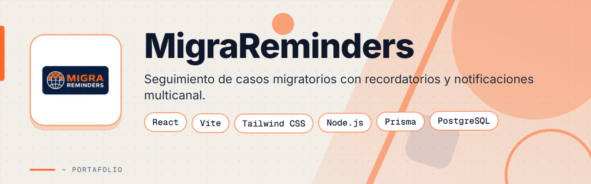
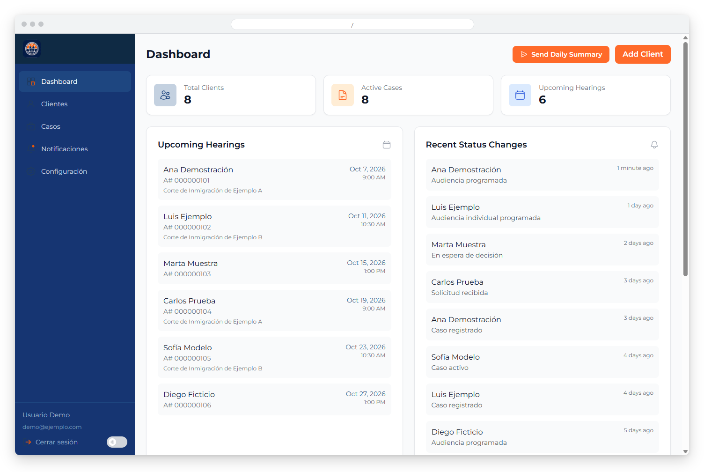
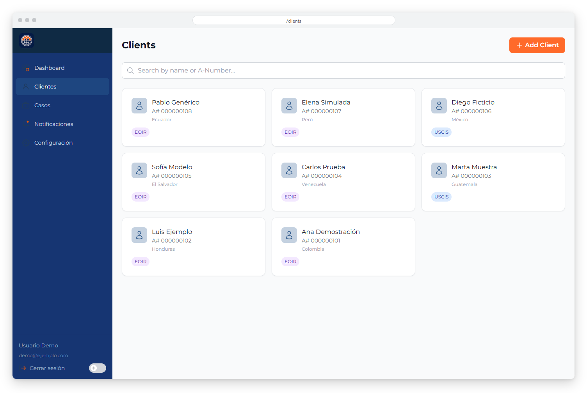
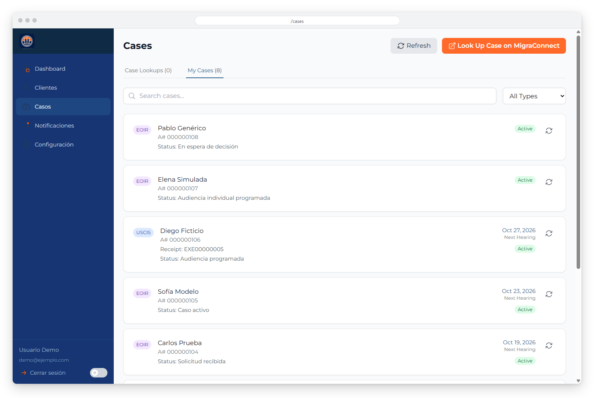
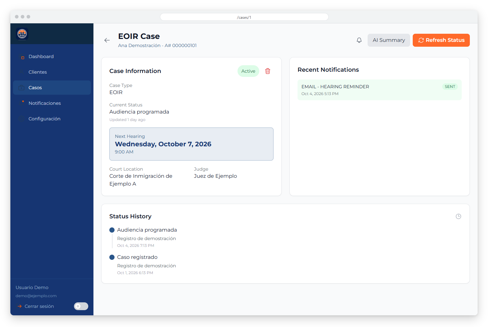
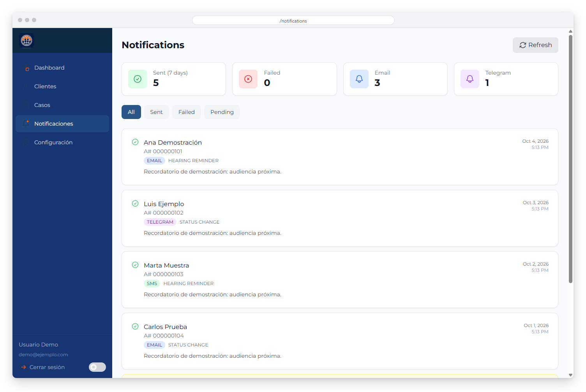
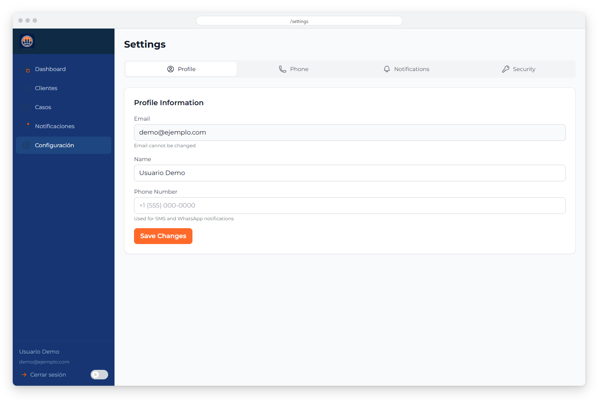
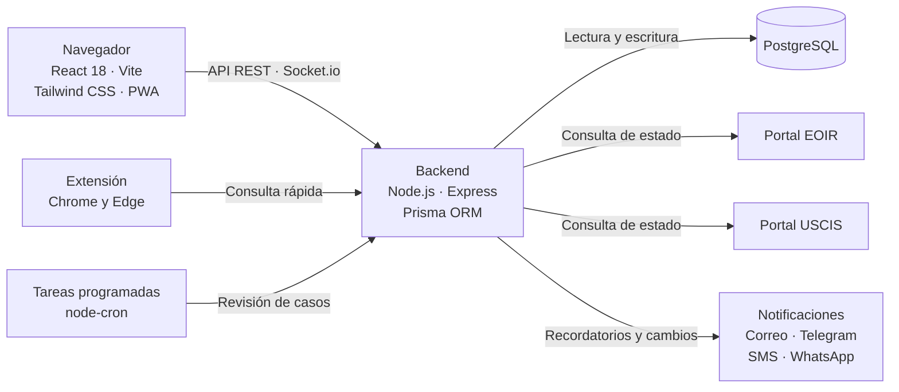

<div align="center">



# MigraReminders


**Sistema de seguimiento de casos de inmigración para un despacho: consulta automática del estado en EOIR y USCIS, recordatorios de audiencia y notificaciones por correo, Telegram y SMS.**

</div>

> Este es un **portafolio showcase**: el código fuente es propietario y no está incluido. Todos los datos de las capturas son ficticios.

---

## Contenido

- [El Problema](#el-problema)
- [La Solución](#la-solución)
- [Funcionalidades](#funcionalidades)
- [Vista Previa](#vista-previa)
- [Arquitectura](#arquitectura)
- [Stack Tecnológico](#stack-tecnológico)
- [Instalación local](#instalación-local)
- [Roadmap](#roadmap)
- [Contacto](#contacto)

---

## El Problema

Un despacho de inmigración que lleva muchos casos a la vez necesita no perder ninguna fecha:

- Revisar a mano el estado de cada caso en los portales de EOIR y USCIS toma horas.
- Una audiencia olvidada puede tener consecuencias graves para el cliente.
- Los clientes esperan recordatorios por el canal que realmente usan.
- El equipo necesita ver en un solo lugar las audiencias próximas y los cambios recientes.

---

## La Solución

Una aplicación web con un backend Node.js y Express sobre PostgreSQL que revisa los casos de forma automática, guarda el historial de estados y envía recordatorios antes de cada audiencia. El panel principal resume audiencias próximas y cambios recientes, y cada caso muestra su historial y las notificaciones enviadas. Se complementa con una extensión de navegador para consultas rápidas.

---

## Funcionalidades

| Funcionalidad | Descripción |
|---------------|-------------|
| Seguimiento EOIR y USCIS | Casos de corte de inmigración por número de extranjería y casos de USCIS por número de recibo |
| Revisión automática | Los casos se revisan según una programación configurable (por defecto cada 6 horas) y se guarda el historial de estados |
| Recordatorios de audiencia | Avisos automáticos a 7, 3 y 1 día de la audiencia, configurables |
| Notificaciones multicanal | Correo, Telegram, SMS y WhatsApp, con el estado de cada envío |
| Gestión de clientes | Clientes con sus casos, búsqueda y detalle con historial de actividad |
| Panel principal | Audiencias próximas, casos activos y cambios recientes de estado |
| Resúmenes con IA | Resúmenes de notas de llamadas y de casos |
| Integración de telefonía | Pantalla emergente al recibir una llamada de un cliente registrado, con RingCentral |
| App instalable y tema | PWA instalable en iPhone y Android, con modo claro y oscuro persistente |
| Extensión de navegador | Consulta rápida de casos con atajos de teclado en Chrome y Edge |

---

## Vista Previa



<table>
  <tr>
    <td width="50%">
      
      <br><b>Clientes</b>: tarjetas con nombre, número de extranjería y tipo de caso, con búsqueda.
    </td>
    <td width="50%">
      
      <br><b>Casos</b>: seguimiento de casos EOIR y USCIS con estado y próxima audiencia.
    </td>
  </tr>
  <tr>
    <td width="50%">
      
      <br><b>Detalle del caso</b>: audiencia, juez, corte, notificaciones e historial de estados.
    </td>
    <td width="50%">
      
      <br><b>Notificaciones</b>: recordatorios enviados por correo, Telegram y SMS con su estado.
    </td>
  </tr>
  <tr>
    <td width="50%">
      
      <br><b>Configuración</b>: perfil, teléfono, notificaciones y seguridad de la cuenta.
    </td>
    <td width="50%"></td>
  </tr>
</table>

---

## Arquitectura



**API REST:** autenticación con JWT y rutas para clientes, casos, panel, notificaciones, llamadas, resúmenes con IA y verificación manual. Las decisiones de arquitectura del frontend están documentadas como ADR (React con Vite, Tailwind, modo oscuro por clase y autenticación con JWT).

---

## Stack Tecnológico

| Capa | Tecnología |
|------|-----------|
| Frontend | React 18 · Vite · Tailwind CSS · React Router |
| Tiempo real | Socket.io |
| Backend | Node.js · Express · Prisma ORM |
| Datos | PostgreSQL |
| Tareas programadas | node-cron |
| Consulta de portales | Puppeteer · Cheerio · scraper en Python |
| Notificaciones | Nodemailer · Telegram Bot · Twilio |
| Telefonía | RingCentral |
| Pruebas | Jest |
| Despliegue | Docker Compose · Nginx |

---

## Instalación local

> **Aviso:** el código es privado y propietario. Estos pasos son solo para colaboradores autorizados con acceso al repositorio.

1. Instala Docker y Docker Compose.
2. Copia `.env.example` a `.env` y completa tus propios valores (base de datos, claves de sesión y canales de notificación).
3. Levanta los servicios con Docker Compose:
   ```bash
   docker compose up -d --build
   ```
4. Aplica las migraciones de Prisma:
   ```bash
   npm run migrate
   ```
5. Para desarrollo local del backend y del frontend:
   ```bash
   npm run dev
   ```

---

## Roadmap

- [ ] Notificaciones push en la app instalable (la PWA ya está preparada).
- [ ] Más pruebas automáticas sobre los servicios de revisión de casos.
- [ ] Ampliar el seguimiento a otros tipos de caso.

---

## Contacto

El código fuente es propietario. Para consultas o propuestas, escríbeme:

[](mailto:pablozam1931@gmail.com)
[%206517--1870-25D366?style=for-the-badge&logo=whatsapp&logoColor=white)](https://wa.me/50765171870)
[](https://github.com/deadlyrat)

- Correo: [pablozam1931@gmail.com](mailto:pablozam1931@gmail.com)
- WhatsApp: [(507) 6517-1870](https://wa.me/50765171870)
- GitHub: [github.com/deadlyrat](https://github.com/deadlyrat)

---

*Parte del portafolio de [deadlyrat](https://github.com/deadlyrat)*
